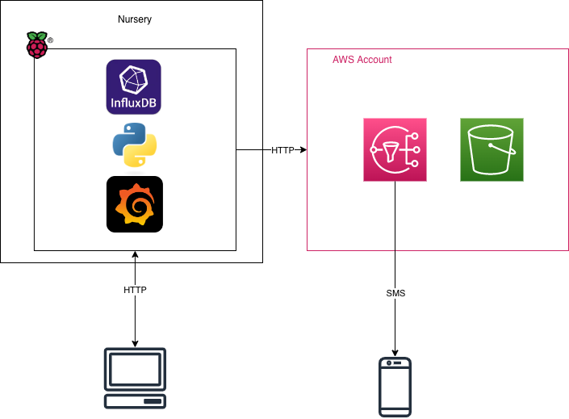

## Author: Jason Harris

### Design

Solution to record temperature and humidity readings, inside and outside the home. Using a Raspberry PI and DHT22 moduel.

### Observability

Grafana running as a daemon process displaying inside and outside temperature and humidity. Accessible to the local network over HTTP via port 3000.

### Storage

InfluxDB running as a daemon process providing data storage for temperature and humidity results.

Amazon Simple Storage Solution (S3) is used to store confirmturation files for the Microservices.

### Compute

Python Microservices running on the Raspberry PI. [sensor_data_logger](https://github.com/jasoniharris/pi_temps/blob/main/inside/sensor_data_logger.py) which collects internal room temperatures via a DHT22 module and [outside_temp_logger](https://github.com/jasoniharris/pi_temps/blob/main/inside/outside_temp_logger.py) which collects outside temperature data from openweathermaprunning via HTTP API. Microservices are scheduled via Cron to run every 10 minutes.

### Notifications

Amazon Simple Notification Service (SNS) is used to provide SMS based notifications to clients. Notifications are triggered if the inside room temperature is unvavorable.
